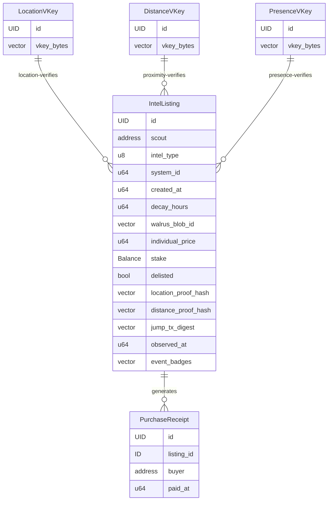

# Architecture

**Last Updated**: 2026-03-21

## System Layers

```
┌─────────────────────────────────────────────────┐
│              React Dashboard (dApp Kit)          │
│   3D Nebula Map · Listing Browser · ZK Proofs    │
├─────────────────────────────────────────────────┤
│           SUI JSON-RPC / GraphQL Layer           │
│    On-chain events · Object queries · Indexing   │
├─────────────────────────────────────────────────┤
│              Move Smart Contracts                │
│    rift_broker::marketplace + Groth16 verification  │
├─────────────────────────────────────────────────┤
│     Seal Encryption · Walrus Storage · ZK Proofs │
│  Conditional decryption · Blobs · Location proof │
├─────────────────────────────────────────────────┤
│                  SUI Blockchain                  │
│  Shared objects · sui::groth16 · ~400ms finality │
└─────────────────────────────────────────────────┘
```

## Component Overview

### Move Contracts (on-chain)

Single module: `rift_broker::marketplace` (~600 lines, 50 tests). Manages:

- **IntelListing** (shared object) — Unencrypted metadata + Walrus blob reference + staked `Balance<SUI>` + expiry via `created_at + decay_hours` + optional `location_proof_hash` for ZK location verification + optional `distance_proof_hash` for ZK proximity + `jump_tx_digest` for on-chain presence audit trail + `event_badges` vector for stackable event verification
- **PurchaseReceipt** (owned, soulbound) — `key` only (no `store`), non-transferable proof of purchase for Seal decryption policy
- **LocationVKey** (shared object) — Groth16 verification key for location attestation circuit, created once at package init
- **DistanceVKey** (shared object) — Groth16 verification key for distance attestation circuit, created once at package init
- **PresenceVKey** (shared object) — Groth16 verification key for unified presence-attestation circuit (Phase 5), created once at package init

Key functions:
- `create_listing` — Standard listing with optional empty blob (for two-step creation)
- `create_verified_listing` — Listing with on-chain Groth16 location proof verification (128-byte proof points + public inputs)
- `attach_distance_proof` — Post-creation function to attach a ZK proximity proof to an existing listing
- `create_presence_verified_listing` — Listing with unified presence proof: distance + timestamp + coordinate hashes + location_hash binding. Takes PresenceVKey, 160-byte public inputs (5×32), and JumpEvent tx digest for audit trail.
- `purchase` — Payment to scout, overpayment refund, receipt minting
- `delist` — Scout-only, refunds staked balance
- `set_walrus_blob_id` — One-time blob ID setter for two-step creation
- `seal_approve` / `seal_approve_scout` — Seal decryption policies
- `attach_event_badge` — Post-creation function to attach a stackable event badge (badge_type + tx_digest) to an existing listing. Scout-only.
- `burn_receipt` — Buyer-only receipt cleanup

Input validation: intel type range, decay hours (1–8760), minimum price, minimum stake, badge type range (0–2).

#### Event Badge Types

| Badge Type | Value | Color | Backed By |
|---|---|---|---|
| Combat Verified | 0 | Red | `KillmailCreatedEvent` tx digest |
| Activity Verified | 1 | Green | `ItemDepositedEvent` tx digest |
| Structure Verified | 2 | Blue | `LocationRevealedEvent` tx digest |

Badges are stored as `{ badge_type: u8, tx_digest: vector<u8> }` entries in the listing's `event_badges` vector. Multiple badges of different types can be attached to a single listing.

### ZK Verification (on-chain + client-side)

Three Groth16 circuits provide different trust signals on listings.

#### Location Attestation (ZK Phase 1)

Proves a scout knows the coordinates of a star system without revealing them (knowledge proof, not presence proof).

**On-chain** (`create_verified_listing`):
1. Parse verification key from `LocationVKey` shared object
2. Deserialize proof points (128 bytes: G1 + G2 + G1 in Arkworks compressed format)
3. Deserialize public inputs (3 signals × 32 bytes LE)
4. Call `sui::groth16::verify_groth16_proof()` — aborts if invalid
5. Store `public_inputs_bytes` as `location_proof_hash` on the listing
6. Emit `VerifiedIntelListed` event

**Client-side** (`lib/zk-proof.ts`, `generateLocationProof`):
1. Lazy-load snarkjs (only on first proof generation)
2. Fetch circuit WASM + proving key from `/public/zk/location-attestation.*`
3. Generate witness and Groth16 proof via `snarkjs.groth16.fullProve()`
4. Convert snarkjs proof format to Arkworks compressed format (endianness, sign bits, G2 ordering)
5. Submit proof bytes + public inputs in `buildCreateVerifiedListingTx`

#### Distance Attestation (ZK Phase 2)

Proves the Manhattan distance between a scout's system and a target system. Displayed as a "Proximity Verified" badge with a human-readable distance (km / light-seconds / light-years).

**Current limitation**: Coordinates are sourced from `galaxy.json` (one coordinate set per solar system). This proves system-to-system distance, not per-object distance within a system. Full precision requires CCP Games to expose in-game location data as POD (Proof of Data), which is not yet available.

**Circuit design** — EVE Frontier uses signed 64-bit coordinates that become ~254-bit BN254 field elements when negative, breaking standard `LessThan(64)` range checks. Solved via **AbsDiff hint pattern**: compute `|a − b|` off-chain and pass as a witness; the circuit verifies `hint² == (a−b)²` plus `Num2Bits(64)` to confirm the hint is a valid 64-bit value.

**On-chain** (`attach_distance_proof`):
1. Parse verification key from `DistanceVKey` shared object
2. Verify Groth16 proof with `sui::groth16::verify_groth16_proof()`
3. Extract `distance_meters` from public inputs (u64 stored as LE bytes)
4. Store `distance_proof_hash` and `distance_meters` on the listing

**Client-side** (`lib/zk-proof.ts`, `generateDistanceProof`):
1. Fetch galaxy coordinates for scout and target systems from `galaxy.json`
2. Compute `absDiffHints` (absolute differences per axis) off-chain as BigInt
3. Generate Groth16 proof via snarkjs, convert to Arkworks format
4. Call `attach_distance_proof` transaction after listing creation

#### Presence Attestation (ZK Phase 5)

Unified circuit that replaces both location and distance for on-chain verified listings. Uses SUI blockchain events as the trust anchor instead of self-signed galaxy.json data.

**Trust model**: Scouts prove they jumped through a gate (JumpEvent) and compute distance to a target assembly using coordinates from LocationRevealedEvents. The circuit binds to the on-chain `location_hash` as a public input for audit trail purposes. (CCP's location_hash uses a different Poseidon variant than circomlibjs, so the binding is audit-only rather than cryptographically enforced.)

**Public signals** (5 total, 160 bytes, snarkjs output-first order):
- `distanceSquared` — (|dx|+|dy|+|dz|)² in meters²
- `timestamp` — JumpEvent block timestamp for on-chain staleness validation
- `coordinatesHash` — Poseidon(scoutX, scoutY, scoutZ, salt)
- `targetHash` — Poseidon(targetX, targetY, targetZ, salt)
- `locationHash` — Poseidon(scoutX, scoutY, scoutZ) — audit binding to on-chain event

**On-chain** (`create_presence_verified_listing`):
1. Parse verification key from `PresenceVKey` shared object
2. Verify Groth16 proof (128-byte proof points + 160-byte public inputs)
3. Extract timestamp from bytes [32..40] for staleness validation (24h cap)
4. Store public inputs as `location_proof_hash`, JumpEvent tx digest as `jump_tx_digest`
5. Emit `IntelListed` + `VerifiedIntelListed` events

**Client-side** (`lib/events.ts` + `lib/zk-proof.ts`):
1. Query `suix_queryEvents` for scout's JumpEvents (no auth required)
2. Fetch `LocationRevealedEvent` for the destination gate → gate coordinates
3. Fetch `LocationRevealedEvent` for target assembly → target coordinates
4. Generate unified Groth16 proof via `generatePresenceProof()`
5. Submit with `buildCreatePresenceVerifiedListingTx()` including JumpEvent tx digest

**Data requirements from CCP Games**: Currently verifies structure proximity (gates, SSUs). Player proximity and resource proximity require CCP to emit additional position events on-chain.

#### Stackable Event Badges (Hybrid Verification)

Not all verification requires ZK proofs. Public on-chain events can serve as trust signals directly via tx digest references, avoiding the overhead of circuit compilation and proof generation.

**Hybrid verification model**: ZK proofs (Groth16) verify private coordinate data that cannot be publicly inspected. Event badges reference public transaction digests that anyone can look up on a block explorer. Together, they form a layered trust system where each badge type adds a different signal.

**Badge trust hierarchy** (highest to lowest):
1. **Combat Verified** (red) — Scout was involved in a kill near the intel location. Strongest signal because combat events are hard to fake and location-specific.
2. **Presence Verified** (purple) — ZK proof of gate jump + proximity to target. Cryptographically verified on-chain.
3. **Activity Verified** (green) — Scout deposited items at a nearby structure. Indicates physical presence.
4. **Structure Verified** (blue) — Scout revealed a structure's location. Weakest event badge but still on-chain evidence.
5. **Proximity** (orange) — ZK distance proof from scout system to target system.
6. **ZK-Verified** (cyan) — Legacy location knowledge proof. Only shown when no event badges are present.

**Frontend rendering** (`lib/badge-verify.ts`):
- `getBadges()` collects all applicable badges for a listing, sorted by trust hierarchy
- `MAX_INLINE_BADGES` controls how many badges render inline before overflow
- `BADGE_TRUST_ORDER` defines the canonical ordering
- ZK-Verified acts as a fallback — suppressed when any event badge is present

### Seal Integration (on-chain + off-chain)

Two entry functions serve as Seal decryption policies:

- `seal_approve(id, receipt, ctx)` — Validates buyer owns the receipt AND the receipt matches the requested listing ID (via BCS address decoding). Called by Seal key servers during decryption simulation.
- `seal_approve_scout(_id, listing, ctx)` — Scouts can always decrypt their own intel.

The Seal encryption identity is the listing's hex address. `fromHex(id)` in the TS SDK produces the same 32 bytes as `bcs::to_bytes(&address)` in Move.

### Walrus Integration (off-chain)

Intel payloads are encrypted and stored on Walrus via HTTP API:

- **Upload**: PUT to `publisher.walrus-testnet.walrus.space/v1/blobs`
- **Download**: GET from `aggregator.walrus-testnet.walrus.space/v1/blobs/{blobId}`
- Two-step listing creation: create listing (empty blob) → encrypt with listing ID → upload → `set_walrus_blob_id`

### React Frontend (off-chain)

Dashboard with 235 tests across 17 test files:

- **3D Nebula Map**: Three.js + React Three Fiber canvas visualization with additive sprite nebulae, region-based navigation, camera focus on selected systems, dynamic glow based on intel density
- **Library layer**: PTB builders (`transactions.ts`), Seal wrappers (`seal.ts`), Walrus client (`walrus.ts`), ZK proof generation (`zk-proof.ts`), Zod schemas (`intel-schemas.ts`), galaxy coordinate data (`galaxy-data.ts`), region aggregation (`region-data.ts`), heat map data (`heat-map-data.ts`), badge rendering (`badge-verify.ts`), event queries (`events.ts` — JumpEvent, LocationRevealedEvent, KillmailEvent, InventoryEvent)
- **Hooks**: `useListings` (paginated event query → object fetch), `usePurchase` (sign + execute), `useDecrypt` (download → decrypt → validate), `useHeatMapData` (aggregate + 60s refresh), `useReceipts` (owned PurchaseReceipt query + listing join)
- **Components**: `CreateListing` (two-step form with optional ZK verification toggle), `ListingBrowser` (filter by type/region/price/verified), `MyIntel` (purchase history + decrypt + receipt management), `MyListings` (scout listing management: delist, reclaim), `PurchaseFlow`, `IntelViewer`, `InfoModal` (landing modal with first-visit auto-show), `FloatingPanel`, `RegionPanel`, `SystemPicker`, `HeatMapControls`

### Data Flow

**Scout creates intel**:
```
Scout fills form → Zod validates payload → create_listing (empty blob, on-chain)
  → encrypt(payload, listingId) via Seal → upload(ciphertext) to Walrus
    → set_walrus_blob_id(listingId, blobId) on-chain
```

**Scout creates ZK-verified intel**:
```
Scout fills form + enables verification → generate Groth16 location proof (snarkjs, client-side)
  → convert proof to Arkworks format → create_verified_listing(proof, inputs, on-chain)
    → sui::groth16::verify_groth16_proof → listing with location_proof_hash
      → encrypt + upload + set_walrus_blob_id (same as above)
```

**Scout attaches proximity proof**:
```
Scout selects target system → fetch galaxy coordinates for both systems
  → compute absDiffHints off-chain → generate Groth16 distance proof (snarkjs)
    → convert to Arkworks format → attach_distance_proof(listingId, proof, inputs)
      → sui::groth16::verify_groth16_proof → listing gains distance_proof_hash + distance_meters
```
*Note: coordinates are currently solar system centroids from `galaxy.json`. Per-object precision requires CCP Games POD data.*

**Scout creates presence-verified intel (Phase 5)**:
```
Scout toggles "Verify with On-Chain Data" → fetchJumpEvents from SUI
  → scout selects jump → fetchLocationEvent for destination gate → gate coordinates
    → scout enters target assembly ID → fetchLocationEvent for target → target coordinates
      → generatePresenceProof(gateCoords, targetCoords, jumpTimestamp)
        → create_presence_verified_listing(proof, inputs, jumpTxDigest)
          → sui::groth16::verify_groth16_proof → listing with location_proof_hash + jump_tx_digest
            → encrypt + upload + set_walrus_blob_id (same as above)
```
*Coordinates come from on-chain LocationRevealedEvents, not galaxy.json.*

**Buyer purchases and decrypts**:
```
Buyer browses listings (IntelListed events → object queries)
  → purchase(listingId, payment) on-chain → PurchaseReceipt minted
    → download(blobId) from Walrus → seal_approve(id, receipt) simulated by key servers
      → decrypt(ciphertext) → Zod validate → render by type
```

## On-Chain Data Model



## Key Design Decisions

### Why Seal + Walrus for intel?

Intel data must be encrypted at rest (information asymmetry is core to EVE's design). Seal provides condition-based decryption natively on SUI — no external oracle or trusted server needed. Walrus handles blob storage so large payloads don't bloat on-chain state.

### Why soulbound PurchaseReceipt?

Receipts have `key` only (no `store`), making them non-transferable. This prevents receipt-sharing that would break Seal access control — only the original buyer can decrypt. The Seal policy checks `receipt.buyer == ctx.sender()`.

### Why shared objects per listing?

Each `IntelListing` is an independent shared object rather than a dynamic field on a single `Marketplace` object. This means purchases on different listings parallelize automatically (no contention). The tradeoff is per-listing overhead, but for an intel marketplace with moderate listing volume, parallelism wins.

### Why PTBs for batch purchase?

Programmable Transaction Blocks allow up to 1,024 commands atomically. A buyer can purchase intel from multiple scouts in a single transaction — batch-purchase 3 listings, get 3 receipts, all atomic. No wrapper contract needed.

### Why on-chain ZK verification?

Groth16 verification via `sui::groth16` runs natively on SUI with ~2ms verification time. Storing only the `location_proof_hash` (public inputs) on-chain keeps state minimal while providing cryptographic proof of scout presence. The verification key lives in a shared `LocationVKey` object created at package init, making it upgradeable without contract migration.

### Why client-side proof generation?

Proof generation is compute-intensive (~2-5s) but only happens at listing creation time. Running it client-side via lazy-loaded snarkjs keeps the architecture simple and avoids a centralized prover service. The Arkworks byte conversion layer handles the format mismatch between snarkjs (JSON, big-endian) and SUI's `sui::groth16` (compressed, little-endian).

### Why the AbsDiff hint pattern for distance proofs?

EVE Frontier coordinates are signed 64-bit integers (e.g., `-5,103,797,186,450,162,000`). In the BN254 scalar field used by Groth16, negative values wrap around to ~254-bit numbers. Standard `LessThan(64)` relies on `Num2Bits(65)` internally — it fails silently on inputs this large, producing wrong results or constraint violations.

The solution: compute `|a − b|` off-chain and pass it as a witness `hint`. The circuit verifies `hint² == (a−b)²` (same absolute value) and `Num2Bits(64)(hint)` (hint is a valid positive 64-bit integer). This sidesteps the sign issue entirely while keeping the constraint sound — an attacker cannot forge a smaller distance because squaring catches sign flips and `Num2Bits` bounds the magnitude.
