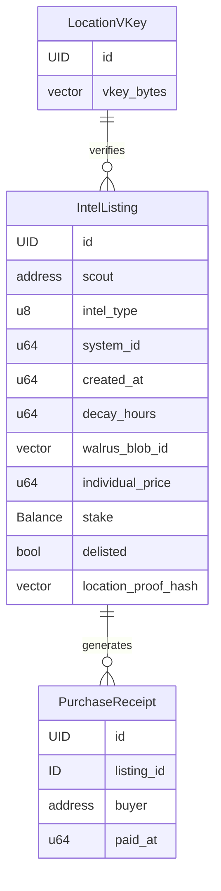

# Architecture

**Last Updated**: 2026-03-14

## System Layers

```
┌─────────────────────────────────────────────────┐
│              React Dashboard (dApp Kit)          │
│   3D Nebula Map · Listing Browser · ZK Proofs    │
├─────────────────────────────────────────────────┤
│           SUI JSON-RPC / GraphQL Layer           │
│    On-chain events · Object queries · Indexing   │
├─────────────────────────────────────────────────┤
│              Move Smart Contracts                │
│    dark_net::marketplace + Groth16 verification  │
├─────────────────────────────────────────────────┤
│     Seal Encryption · Walrus Storage · ZK Proofs │
│  Conditional decryption · Blobs · Location proof │
├─────────────────────────────────────────────────┤
│                  SUI Blockchain                  │
│  Shared objects · sui::groth16 · ~400ms finality │
└─────────────────────────────────────────────────┘
```

## Component Overview

### Move Contracts (on-chain)

Single module: `dark_net::marketplace` (~350 lines, 25 tests). Manages:

- **IntelListing** (shared object) — Unencrypted metadata + Walrus blob reference + staked `Balance<SUI>` + expiry via `created_at + decay_hours` + optional `location_proof_hash` for ZK verification
- **PurchaseReceipt** (owned, soulbound) — `key` only (no `store`), non-transferable proof of purchase for Seal decryption policy
- **LocationVKey** (shared object) — Groth16 verification key bytes, created once at package init

Key functions:
- `create_listing` — Standard listing with optional empty blob (for two-step creation)
- `create_verified_listing` — Listing with on-chain Groth16 proof verification (128-byte proof points + public inputs)
- `purchase` — Payment to scout, overpayment refund, receipt minting
- `delist` — Scout-only, refunds staked balance
- `set_walrus_blob_id` — One-time blob ID setter for two-step creation
- `seal_approve` / `seal_approve_scout` — Seal decryption policies
- `burn_receipt` — Buyer-only receipt cleanup

Input validation: intel type range, decay hours (1–8760), minimum price, minimum stake.

### ZK Verification (on-chain + client-side)

Scouts can attach a Groth16 zero-knowledge location proof to listings, proving physical presence at a star system without revealing exact coordinates.

**On-chain** (`create_verified_listing`):
1. Parse verification key from `LocationVKey` shared object
2. Deserialize proof points (128 bytes: G1 + G2 + G1 in Arkworks compressed format)
3. Deserialize public inputs (3 signals × 32 bytes LE)
4. Call `sui::groth16::verify_groth16_proof()` — aborts if invalid
5. Store `public_inputs_bytes` as `location_proof_hash` on the listing
6. Emit `VerifiedIntelListed` event

**Client-side** (`lib/zk-proof.ts`):
1. Lazy-load snarkjs (only on first proof generation)
2. Fetch circuit WASM + proving key from `/public/zk/`
3. Generate witness and Groth16 proof via `snarkjs.groth16.fullProve()`
4. Convert snarkjs proof format to Arkworks compressed format (endianness, sign bits, G2 ordering)
5. Submit proof bytes + public inputs in `buildCreateVerifiedListingTx`

### Seal Integration (on-chain + off-chain)

Two entry functions serve as Seal decryption policies:

- `seal_approve(id, receipt, ctx)` — Validates buyer owns the receipt AND the receipt matches the requested listing ID (via BCS address decoding). Called by Seal key servers during decryption simulation.
- `seal_approve_scout(_id, listing, ctx)` — Scouts can always decrypt their own intel.

The Seal encryption identity is the listing's hex address. `fromHex(id)` in the TS SDK produces the same 32 bytes as `bcs::to_bytes(&address)` in Move.

### Walrus Integration (off-chain)

Intel payloads are encrypted and stored on Walrus via HTTP API:

- **Upload**: PUT to `publisher.walrus-testnet.walrus.space/v1/blobs`
- **Download**: GET from `aggregator.walrus-testnet.walrus.space/v1/blobs/{blobId}`
- Two-step listing creation: create listing (empty blob) → encrypt with listing ID → upload → `set_walrus_blob_id`

### React Frontend (off-chain)

Dashboard with 182 tests across 15 test files:

- **3D Nebula Map**: Three.js + React Three Fiber canvas visualization with additive sprite nebulae, region-based navigation, camera focus on selected systems, dynamic glow based on intel density
- **Library layer**: PTB builders (`transactions.ts`), Seal wrappers (`seal.ts`), Walrus client (`walrus.ts`), ZK proof generation (`zk-proof.ts`), Zod schemas (`intel-schemas.ts`), galaxy coordinate data (`galaxy-data.ts`), region aggregation (`region-data.ts`), heat map data (`heat-map-data.ts`)
- **Hooks**: `useListings` (paginated event query → object fetch), `usePurchase` (sign + execute), `useDecrypt` (download → decrypt → validate), `useHeatMapData` (aggregate + 60s refresh)
- **Components**: `CreateListing` (two-step form with optional ZK verification toggle), `ListingBrowser` (filter by type/region/price/verified), `MyIntel` (purchase history + decrypt + receipt management), `PurchaseFlow`, `IntelViewer`, `HeatMapControls`

### Data Flow

**Scout creates intel**:
```
Scout fills form → Zod validates payload → create_listing (empty blob, on-chain)
  → encrypt(payload, listingId) via Seal → upload(ciphertext) to Walrus
    → set_walrus_blob_id(listingId, blobId) on-chain
```

**Scout creates ZK-verified intel**:
```
Scout fills form + enables verification → generate Groth16 proof (snarkjs, client-side)
  → convert proof to Arkworks format → create_verified_listing(proof, inputs, on-chain)
    → sui::groth16::verify_groth16_proof → listing with location_proof_hash
      → encrypt + upload + set_walrus_blob_id (same as above)
```

**Buyer purchases and decrypts**:
```
Buyer browses listings (IntelListed events → object queries)
  → purchase(listingId, payment) on-chain → PurchaseReceipt minted
    → download(blobId) from Walrus → seal_approve(id, receipt) simulated by key servers
      → decrypt(ciphertext) → Zod validate → render by type
```

## On-Chain Data Model



## Key Design Decisions

### Why Seal + Walrus for intel?

Intel data must be encrypted at rest (information asymmetry is core to EVE's design). Seal provides condition-based decryption natively on SUI — no external oracle or trusted server needed. Walrus handles blob storage so large payloads don't bloat on-chain state.

### Why soulbound PurchaseReceipt?

Receipts have `key` only (no `store`), making them non-transferable. This prevents receipt-sharing that would break Seal access control — only the original buyer can decrypt. The Seal policy checks `receipt.buyer == ctx.sender()`.

### Why shared objects per listing?

Each `IntelListing` is an independent shared object rather than a dynamic field on a single `Marketplace` object. This means purchases on different listings parallelize automatically (no contention). The tradeoff is per-listing overhead, but for an intel marketplace with moderate listing volume, parallelism wins.

### Why PTBs for batch purchase?

Programmable Transaction Blocks allow up to 1,024 commands atomically. A buyer can purchase intel from multiple scouts in a single transaction — batch-purchase 3 listings, get 3 receipts, all atomic. No wrapper contract needed.

### Why on-chain ZK verification?

Groth16 verification via `sui::groth16` runs natively on SUI with ~2ms verification time. Storing only the `location_proof_hash` (public inputs) on-chain keeps state minimal while providing cryptographic proof of scout presence. The verification key lives in a shared `LocationVKey` object created at package init, making it upgradeable without contract migration.

### Why client-side proof generation?

Proof generation is compute-intensive (~2-5s) but only happens at listing creation time. Running it client-side via lazy-loaded snarkjs keeps the architecture simple and avoids a centralized prover service. The Arkworks byte conversion layer handles the format mismatch between snarkjs (JSON, big-endian) and SUI's `sui::groth16` (compressed, little-endian).
