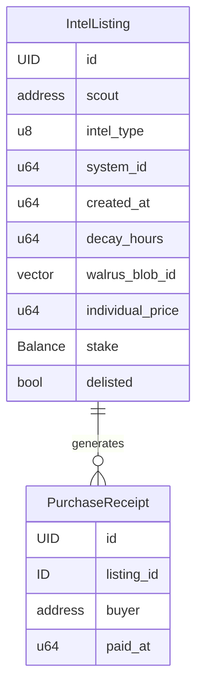

# Dark Net — Encrypted Intel Marketplace

## Overview

An encrypted intelligence marketplace for EVE Frontier where scouts sell structured intel using SUI-native Seal encryption and Walrus storage. Buyers browse unencrypted metadata, pay to unlock decryption, and view intel client-side. The hero feature is a live intel heat map overlaid on the star system map.

**Target**: EVE Frontier × SUI Hackathon, March 11–31, 2026 ($80K prize pool)
**Builder**: Solo, some Move experience
**Timeline**: 5 weeks (Feb 12 – Mar 19, with buffer before Mar 31 deadline)

---

## Problem Statement

EVE Frontier has zero collaborative intel infrastructure. The SUI migration unlocked Seal (encrypted data with conditional decryption) and Walrus (decentralized blob storage), enabling information markets impossible on any other blockchain. No one has built this yet.

---

## Proposed Solution

A two-layer system for MVP:

1. **Move smart contract** (on-chain): Single `marketplace.move` module — intel listing, payment with receipt pattern for PTB composability, listing management
2. **Seal + Walrus** (off-chain storage): Encrypted intel payloads on Walrus, decryption controlled by on-chain Seal policies checking purchase receipts
3. **React dashboard** (external app): Listing browser, purchase/decrypt flow, heat map

---

## Technical Approach

### Architecture

```
┌─────────────────────────────────────────────────┐
│              React Dashboard (dApp Kit)           │
│   Heat Map · Listing Browser · Purchase Flow      │
├─────────────────────────────────────────────────┤
│           SUI GraphQL RPC Subscriptions           │
│     Event streams · Object queries · Indexing     │
├─────────────────────────────────────────────────┤
│              Move Smart Contract                  │
│           dark_net::marketplace                   │
├─────────────────────────────────────────────────┤
│         Seal Encryption · Walrus Storage          │
│  Conditional decryption · Blob storage/retrieval  │
├─────────────────────────────────────────────────┤
│                SUI Blockchain                     │
│   Shared objects · Events · ~400ms finality       │
└─────────────────────────────────────────────────┘
```

### On-Chain Data Model



### Module Responsibility Map

Single module for MVP — complexity lives in the frontend integration, not the contract:

| Module | File | Shared Objects | Key Functions |
|--------|------|---------------|---------------|
| **marketplace** | `sources/marketplace.move` | `IntelListing` | `create_listing()`, `purchase()`, `delist()`, getters |

---

### Implementation Phases

#### Phase 0: Spikes + Scaffolding (Week 1)

**Goal**: Retire the two biggest unknowns (Seal and Walrus), then scaffold the project.

This is a full week, not two days. Seal integration is the make-or-break risk.

**Tasks**:

- [ ] **Spike: Seal conditional access policy API** (days 1–3):
  - Read Seal docs end-to-end
  - Write a minimal test: encrypt a blob, define a policy that checks for a specific address, decrypt
  - Determine: does the Seal policy live on-chain (Move object) or off-chain (SDK config)?
  - Determine: how does Seal verify a `PurchaseReceipt` exists? Does it query on-chain state, or does the client pass proof?
  - Document the actual API in a `docs/seal-spike.md`
  - **If Seal is unworkable**: fall back to symmetric encryption with key stored in a Move object, revealed on purchase. Weaker but functional.
- [ ] **Spike: Walrus blob storage** (day 2–3, parallel with Seal):
  - Write a minimal test: upload a JSON blob, retrieve by ID, confirm round-trip integrity
  - Determine: blob size limits, latency, SDK availability for TypeScript
  - **Serialization format**: JSON (stringify → Uint8Array → encrypt → upload). Document this.
- [ ] Initialize git repository + `.gitignore` (exclude `venv/`, `node_modules/`, `build/`, `.env`)
- [ ] Install SUI CLI
- [ ] Create Move package:

```
contracts/
├── Move.toml
├── sources/
│   └── marketplace.move
└── tests/
    └── marketplace_tests.move
```

`contracts/Move.toml`:
```toml
[package]
name = "dark_net"
edition = "2024"

[addresses]
dark_net = "0x0"
```

- [ ] Scaffold React frontend:

```bash
pnpm create @mysten/dapp --template react-client-dapp frontend
cd frontend && pnpm install
```

- [ ] Verify `sui move build` compiles, `pnpm dev` serves

**Exit criteria**: Seal spike produces a working encrypt/decrypt round-trip with conditional access. Walrus spike produces a working upload/download round-trip. Spike findings documented. Move package compiles. React scaffold runs.

---

#### Phase 1: Core Marketplace Contract (Week 2)

**Goal**: One Move module that handles listing, purchasing, and delisting.

##### 1a. `marketplace.move` — Structs

```move
module dark_net::marketplace;

use sui::balance::{Self, Balance};
use sui::coin::{Self, Coin};
use sui::clock::Clock;
use sui::event;
use sui::sui::SUI;

// === Error constants (EPascalCase) ===

const ENotScout: u64 = 0;
const EInsufficientPayment: u64 = 1;
const EListingExpired: u64 = 2;
const EListingDelisted: u64 = 3;

// === Regular constants (ALL_CAPS) ===

const INTEL_TYPE_RESOURCE: u8 = 0;
const INTEL_TYPE_FLEET: u8 = 1;
const INTEL_TYPE_BASE: u8 = 2;
const INTEL_TYPE_ROUTE: u8 = 3;

// === Objects ===

/// Core listing. Shared object so multiple buyers can purchase concurrently.
/// Holds actual staked tokens in `stake` field (not just a u64 amount).
/// `delisted` tracks manual removal; expiry is computed from created_at + decay_hours.
public struct IntelListing has key {
    id: UID,
    scout: address,
    intel_type: u8,
    system_id: u64,
    created_at: u64,
    decay_hours: u64,
    walrus_blob_id: vector<u8>,
    individual_price: u64,
    stake: Balance<SUI>,
    delisted: bool,
}

/// Proof of purchase. `key` only — NOT `store` — so receipts are
/// non-transferable. Seal policy checks receipt.buyer == requester.
public struct PurchaseReceipt has key {
    id: UID,
    listing_id: ID,
    buyer: address,
    paid_at: u64,
}

// === Events (past tense) ===

public struct IntelListed has copy, drop {
    listing_id: ID,
    scout: address,
    intel_type: u8,
    system_id: u64,
}

public struct IntelPurchased has copy, drop {
    listing_id: ID,
    buyer: address,
    price_paid: u64,
}

public struct IntelDelisted has copy, drop {
    listing_id: ID,
    scout: address,
}
```

**Key design decisions applied from review**:
- `stake: Balance<SUI>` — actual tokens, not a `u64` ghost. Enables `delist()` refund and future dispute extraction.
- `PurchaseReceipt` has `key` only, NOT `store` — non-transferable. Prevents receipt-sharing that would break Seal access control.
- `delisted: bool` instead of `active: bool` — clearer semantics (a listing can be "not delisted" but still expired).
- Single module — no `intel.move`, `reputation.move`, `access_policy.move`, or `dispute.move` in MVP.

##### 1b. `marketplace.move` — Functions

- [ ] `create_listing()`:
  - Parameter order: primitives (type, system_id, price, decay_hours, blob_id) → `Coin<SUI>` (stake) → `Clock` → `TxContext`
  - Converts stake coin to `Balance<SUI>` via `coin.into_balance()`
  - Creates shared `IntelListing` object via `transfer::share_object()`
  - Emits `IntelListed` event
- [ ] `purchase()` (composable — returns `PurchaseReceipt` for PTB chaining):
  - Parameter order: `listing: &mut IntelListing` → `payment: Coin<SUI>` → `Clock` → `TxContext`
  - Validates: `!listing.delisted`, `clock.timestamp_ms() < listing.created_at + listing.decay_hours * 3_600_000`
  - Validates: `payment.value() >= listing.individual_price`
  - Transfers payment to scout via `transfer::public_transfer(payment, listing.scout)`
  - Creates `PurchaseReceipt` with `buyer: ctx.sender()`, transfers to buyer
  - Emits `IntelPurchased`
  - **Returns nothing** — receipt is transferred, not returned (because `key`-only objects can't be returned from PTBs without `store`)
- [ ] `delist()`:
  - Only scout: `assert!(listing.scout == ctx.sender(), ENotScout)`
  - Withdraws stake: `let refund = listing.stake.withdraw_all().into_coin(ctx)`
  - Transfers refund to scout
  - Sets `listing.delisted = true`
  - Emits `IntelDelisted`
- [ ] Getters (field-named, no `get_` prefix):
  - `scout()`, `intel_type()`, `system_id()`, `created_at()`, `decay_hours()`, `walrus_blob_id()`, `individual_price()`, `delisted()`
  - `is_expired(listing: &IntelListing, clock: &Clock): bool` — computed from fields

##### 1c. Tests — `marketplace_tests.move`

- [ ] `listing_creation_works`: Create listing, verify all fields via getters with `assert_eq!`
- [ ] `listing_holds_stake`: Create → verify stake balance equals deposited amount
- [ ] `delist_refunds_stake`: Create → delist → verify scout received tokens
- [ ] `purchase_creates_receipt`: Purchase → verify receipt exists (TestScenario, multi-address)
- [ ] `purchase_pays_scout`: Purchase → verify scout balance increased by price
- [ ] `#[test, expected_failure(abort_code = ENotScout)] delist_by_non_scout_aborts`
- [ ] `#[test, expected_failure(abort_code = EListingExpired)] purchase_expired_listing_aborts`
- [ ] `#[test, expected_failure(abort_code = EInsufficientPayment)] purchase_underpayment_aborts`
- [ ] `#[test, expected_failure(abort_code = EListingDelisted)] purchase_delisted_listing_aborts`

**Exit criteria**: `sui move test` passes all tests. Contract deployed to local devnet.

---

#### Phase 2: Frontend — List, Purchase, Decrypt (Week 3)

**Goal**: End-to-end flow in the browser — create listing, browse, purchase, decrypt.

##### 2a. Frontend Architecture

```
frontend/src/
├── providers/
│   └── AppProviders.tsx          # dApp Kit + QueryClient wrappers
├── lib/
│   ├── transactions.ts           # PTB builder functions (pure, no React)
│   ├── seal.ts                   # Seal encrypt/decrypt wrappers (pure async)
│   ├── walrus.ts                 # Walrus upload/download wrappers (pure async)
│   ├── types.ts                  # TypeScript types mirroring on-chain structs (bigint for u64)
│   ├── constants.ts              # Package ID, Clock ID, intel type enum
│   └── intel-schemas.ts          # Zod schemas for 4 intel payload types
├── hooks/
│   ├── useListings.ts            # Fetch + subscribe to IntelListing objects
│   ├── usePurchase.ts            # PTB execution + receipt tracking
│   └── useDecrypt.ts             # Seal decrypt lifecycle (fetch blob → decrypt → parse)
├── components/
│   ├── CreateListing.tsx          # Scout form → encrypt → upload → list
│   ├── ListingBrowser.tsx         # Browse + filter active listings
│   ├── PurchaseFlow.tsx           # Pay → await receipt → trigger decrypt
│   └── IntelViewer.tsx            # Render decrypted intel by schema type
└── App.tsx
```

**Key architectural decisions applied from review**:
- `lib/transactions.ts` — PTB construction extracted from components into pure testable functions
- `lib/types.ts` — all `u64` fields are `bigint`, not `number` (JavaScript overflow protection)
- `lib/intel-schemas.ts` — Zod discriminated union for payload validation on both scout (form) and buyer (decrypt) sides
- `lib/seal.ts` + `lib/walrus.ts` — isolate the two biggest unknowns behind clean async interfaces
- Error handling designed alongside purchase flow, not bolted on later

##### 2b. `lib/types.ts` — TypeScript Type Mirrors

```typescript
export const INTEL_TYPES = {
  RESOURCE: 0,
  FLEET: 1,
  BASE: 2,
  ROUTE: 3,
} as const

export type IntelType = typeof INTEL_TYPES[keyof typeof INTEL_TYPES]

export interface IntelListingFields {
  readonly id: string
  readonly scout: string
  readonly intelType: IntelType
  readonly systemId: bigint
  readonly createdAt: bigint
  readonly decayHours: bigint
  readonly walrusBlobId: Uint8Array
  readonly individualPrice: bigint
  readonly delisted: boolean
}

export interface PurchaseReceiptFields {
  readonly id: string
  readonly listingId: string
  readonly buyer: string
  readonly paidAt: bigint
}
```

##### 2c. `lib/intel-schemas.ts` — Zod Payload Validation

```typescript
import { z } from 'zod'

const resourceSchema = z.object({
  type: z.literal(0),
  systemId: z.string(),
  coordinates: z.object({ x: z.number(), y: z.number(), z: z.number() }),
  resourceType: z.string(),
  yieldEstimate: z.number(),
})

const fleetSchema = z.object({
  type: z.literal(1),
  systemId: z.string(),
  fleetSize: z.number().int().positive(),
  shipTypes: z.array(z.string()),
  heading: z.string().optional(),
  observedAt: z.string(),
})

const baseSchema = z.object({
  type: z.literal(2),
  systemId: z.string(),
  structureType: z.string(),
  defenseLevel: z.number().int().min(0).max(10),
  ownerTribe: z.string().optional(),
})

const routeSchema = z.object({
  type: z.literal(3),
  originSystemId: z.string(),
  destSystemId: z.string(),
  threatLevel: z.number().int().min(0).max(10),
  gateCamps: z.array(z.object({
    systemId: z.string(),
    description: z.string(),
  })),
})

export const intelPayloadSchema = z.discriminatedUnion('type', [
  resourceSchema,
  fleetSchema,
  baseSchema,
  routeSchema,
])

export type IntelPayload = z.infer<typeof intelPayloadSchema>
```

##### 2d. `lib/transactions.ts` — Pure PTB Builders

```typescript
import { Transaction } from '@mysten/sui/transactions'

import { CLOCK_ID, PACKAGE_ID } from './constants'

export function buildCreateListingTx(params: {
  intelType: number
  systemId: bigint
  price: bigint
  decayHours: bigint
  walrusBlobId: Uint8Array
  stakeAmount: bigint
}): Transaction {
  const tx = new Transaction()
  const [stakeCoin] = tx.splitCoins(tx.gas, [tx.pure.u64(params.stakeAmount)])
  tx.moveCall({
    target: `${PACKAGE_ID}::marketplace::create_listing`,
    arguments: [
      tx.pure.u8(params.intelType),
      tx.pure.u64(params.systemId),
      tx.pure.u64(params.price),
      tx.pure.u64(params.decayHours),
      tx.pure.vector('u8', Array.from(params.walrusBlobId)),
      stakeCoin,
      tx.object(CLOCK_ID),
    ],
  })
  return tx
}

export function buildPurchaseTx(
  listingId: string,
  price: bigint,
): Transaction {
  const tx = new Transaction()
  const [coin] = tx.splitCoins(tx.gas, [tx.pure.u64(price)])
  tx.moveCall({
    target: `${PACKAGE_ID}::marketplace::purchase`,
    arguments: [
      tx.object(listingId),
      coin,
      tx.object(CLOCK_ID),
    ],
  })
  return tx
}

export function buildBatchPurchaseTx(
  purchases: ReadonlyArray<{ listingId: string; price: bigint }>,
): Transaction {
  const tx = new Transaction()
  for (const { listingId, price } of purchases) {
    const [coin] = tx.splitCoins(tx.gas, [tx.pure.u64(price)])
    tx.moveCall({
      target: `${PACKAGE_ID}::marketplace::purchase`,
      arguments: [
        tx.object(listingId),
        coin,
        tx.object(CLOCK_ID),
      ],
    })
  }
  return tx
}
```

##### 2e. Component Implementation

- [ ] `CreateListing.tsx`:
  - Intel type selector → renders matching Zod schema form
  - Validates input against `intelPayloadSchema`
  - On submit: `JSON.stringify(payload)` → `Uint8Array` → `seal.encrypt()` → `walrus.upload()` → `buildCreateListingTx()` → sign + execute
  - Error states: Seal encryption failure, Walrus upload failure, transaction rejection
- [ ] `ListingBrowser.tsx`:
  - Queries all `IntelListing` objects via SUI GraphQL
  - Client-side filtering: by intel type, system ID, freshness (computed from `createdAt + decayHours`)
  - Sort by price or recency
  - Displays: type icon, system, time remaining, price, scout address (truncated)
- [ ] `PurchaseFlow.tsx`:
  - Price display + confirm button
  - Calls `buildPurchaseTx()` → sign + execute via dApp Kit
  - On success: queries for new `PurchaseReceipt` owned by buyer
  - Triggers decrypt flow automatically
  - Error states: insufficient balance, listing expired between browse and purchase, transaction failure
- [ ] `IntelViewer.tsx`:
  - Receives `walrusBlobId` + receipt proof
  - `walrus.download(blobId)` → `seal.decrypt(blob, receiptProof)` → `JSON.parse()` → `intelPayloadSchema.safeParse()`
  - Switch on `payload.type` to render appropriate visualization (coordinates, fleet table, etc.)
  - Error states: Walrus unavailable (show retry), Seal decrypt failure (show "access denied"), invalid payload (show "corrupted data")

**Exit criteria**: A scout can create a listing from the UI. A buyer can browse, purchase, and see decrypted intel. PTB batch purchase works for 2+ listings.

---

#### Phase 3: Heat Map + Polish (Week 4)

**Goal**: The "wow" demo. Visually compelling, demo-ready product.

##### 3a. Heat Map Components

Split into focused components (not one monolith):

```
components/
├── heat-map/
│   ├── HeatMap.tsx               # Canvas/SVG container + zoom/pan
│   ├── SystemNode.tsx            # Individual system glow + pulse animation
│   └── HeatMapControls.tsx       # Filter by type, price range
```

- [ ] `HeatMap.tsx`:
  - Star system map (data source: EVE Frontier API, Atlas, or hardcoded 20 systems for demo)
  - Positions systems on a 2D canvas
  - Delegates rendering to `SystemNode` per system
- [ ] `SystemNode.tsx`:
  - Glow intensity = active listing count in system
  - Hue = dominant intel type (resource=green, fleet=red, base=orange, route=blue)
  - Opacity = freshness (fully opaque → fade as listings age)
  - Pulse animation = new listing in last 60 seconds
  - Click → expand to show individual listings inline
- [ ] `HeatMapControls.tsx`:
  - Filter toggles by intel type
  - Price range slider
- [ ] `hooks/useHeatMapData.ts`:
  - Aggregate listings by `system_id`
  - Compute density/freshness per system
  - Subscribe to `IntelListed` / `IntelDelisted` events for real-time updates

##### 3b. UX Polish

- [ ] Loading states for all async operations (listing queries, purchase tx, Walrus fetch, Seal decrypt)
- [ ] Error boundaries around purchase + decrypt flow (the most failure-prone path)
- [ ] Dark theme (fits "Dark Net" branding)
- [ ] Mobile-responsive layout (judges may view on phone)

**Exit criteria**: Heat map renders with real on-chain data. New listings pulse in real-time. Filter controls work. Dark theme applied.

---

#### Phase 4: Deploy + Submit (Week 5)

**Goal**: Deployed, recorded, and submitted.

- [ ] Deploy contracts to SUI testnet
- [ ] Deploy frontend (Vercel or similar)
- [ ] Seed 10–20 listings across different systems for demo
- [ ] Record demo video:
  - Scout creates encrypted listing → appears on heat map
  - Buyer browses → purchases → sees decrypted intel (the "aha" moment)
  - Show PTB batch purchase (2+ listings in one transaction)
  - Show heat map real-time update
- [ ] Write submission narrative emphasizing:
  - Seal + Walrus as SUI-native differentiators (impossible on other chains)
  - PTB composability for batch operations
  - Information asymmetry as core EVE design philosophy
  - Wormhole mapper background for spatial visualization credibility
- [ ] Submit before voting period begins

**Exit criteria**: Live on testnet. Demo video uploaded. Submission narrative complete.

---

## Edge Cases & Error States (MVP)

| Scenario | Expected Behavior |
|----------|------------------|
| Purchase expired listing | Abort with `EListingExpired` |
| Insufficient payment | Abort with `EInsufficientPayment` |
| Non-scout tries to delist | Abort with `ENotScout` |
| Purchase delisted listing | Abort with `EListingDelisted` |
| Walrus blob unavailable | Frontend shows error + retry button |
| Seal decrypt failure | Frontend shows "access denied" with support hint |
| Invalid payload after decrypt | Frontend shows "corrupted data" (Zod parse failed) |
| Same buyer purchases same listing twice | Allow — idempotent, creates second receipt |

---

## Constants & Configuration (MVP)

```move
// Error codes (EPascalCase)
const ENotScout: u64 = 0;
const EInsufficientPayment: u64 = 1;
const EListingExpired: u64 = 2;
const EListingDelisted: u64 = 3;

// Regular constants (ALL_CAPS)
const INTEL_TYPE_RESOURCE: u8 = 0;
const INTEL_TYPE_FLEET: u8 = 1;
const INTEL_TYPE_BASE: u8 = 2;
const INTEL_TYPE_ROUTE: u8 = 3;
```

---

## Open Questions (MVP)

| # | Question | Blocks | Resolution Strategy |
|---|----------|--------|-------------------|
| 1 | EVE Frontier's token contract on SUI | Payment integration | Search EVE Frontier docs/Discord. Use SUI native token as fallback. |
| 2 | Star map data source (system coordinates) | Heat map | Check EVE Frontier API, Atlas, or community Discord. Hardcode 20 systems for demo. |
| 3 | Seal conditional policy API specifics | Encryption flow | **Week 1 spike (full week)**. This is the #1 risk. |
| 4 | Smart Assembly deployment type | In-game presence | Likely SSU. Confirm with builder docs. Not blocking for external app submission. |

---

## Acceptance Criteria (MVP)

### Functional Requirements

- [ ] Scout can create an encrypted intel listing with structured metadata and staked tokens
- [ ] Buyer can browse listings filtered by type, system, and freshness
- [ ] Buyer can purchase intel and decrypt it client-side via Seal
- [ ] Decrypted intel renders correctly based on schema type (Zod-validated)
- [ ] Heat map shows real-time intel density across star systems with freshness decay
- [ ] PTB batch purchase works for 2+ listings in a single transaction

### Non-Functional Requirements

- [ ] Contract compiles with `sui move build` on edition 2024
- [ ] All tests pass via `sui move test`
- [ ] Frontend follows code style: no semicolons, single quotes, 2-space indent
- [ ] All Move code follows the Code Quality Checklist (modern syntax, parameter ordering)
- [ ] All `u64` values in TypeScript use `bigint` (no overflow)

### Quality Gates

- [ ] Phase 0 Seal spike produces working encrypt/decrypt round-trip before any contract work
- [ ] Phase 0 Walrus spike produces working upload/download round-trip
- [ ] Each phase has passing tests before moving to next
- [ ] Demo video recorded by week 5

---

## Risk Analysis & Mitigation

| Risk | Likelihood | Impact | Mitigation |
|------|-----------|--------|------------|
| Seal API immature or underdocumented | Medium | Critical | Full week 1 spike. If unworkable, fall back to symmetric encryption with key escrow in a Move object. |
| EVE Frontier game API unavailable for star map | Medium | High | Hardcode 20 high-traffic systems for demo. |
| Move learning curve exceeds estimate | Low | High | Conventions documented in brainstorm. Single module keeps scope tight. |
| Hackathon deadline pressure | Medium | High | Phases ordered by demo value. Heat map + core loop is a compelling demo even without polish. |

---

## File Structure (MVP)

```
EF_intel/
├── CLAUDE.md
├── README.md
├── .gitignore
├── contracts/
│   ├── Move.toml
│   ├── sources/
│   │   └── marketplace.move
│   └── tests/
│       └── marketplace_tests.move
├── frontend/
│   ├── package.json
│   ├── tsconfig.json
│   ├── src/
│   │   ├── App.tsx
│   │   ├── providers/
│   │   │   └── AppProviders.tsx
│   │   ├── lib/
│   │   │   ├── transactions.ts
│   │   │   ├── seal.ts
│   │   │   ├── walrus.ts
│   │   │   ├── types.ts
│   │   │   ├── constants.ts
│   │   │   └── intel-schemas.ts
│   │   ├── hooks/
│   │   │   ├── useListings.ts
│   │   │   ├── usePurchase.ts
│   │   │   └── useDecrypt.ts
│   │   └── components/
│   │       ├── CreateListing.tsx
│   │       ├── ListingBrowser.tsx
│   │       ├── PurchaseFlow.tsx
│   │       ├── IntelViewer.tsx
│   │       └── heat-map/
│   │           ├── HeatMap.tsx
│   │           ├── SystemNode.tsx
│   │           └── HeatMapControls.tsx
│   └── public/
├── docs/
│   ├── eve_frontier_hackathon26.md
│   ├── ARCHITECTURE.md
│   ├── seal-spike.md              # Phase 0 spike findings
│   ├── brainstorms/
│   │   └── 2026-02-12-dark-net-intel-marketplace-brainstorm.md
│   └── plans/
│       └── 2026-02-12-feat-dark-net-encrypted-intel-marketplace-plan.md
└── venv/
```

---

## Post-MVP: Future Phases

Items below were scoped out of MVP based on review feedback. Each is independently addable after the core marketplace + heat map ships.

### Post-MVP A: Dispute System

**Prerequisites**: Working marketplace with purchase flow.

- [ ] `contracts/sources/dispute.move` — separate module
- [ ] `DisputeTicket` hot potato (no abilities — forces consumption, prevents abandonment)
- [ ] `Dispute` shared object with voting: `VecMap<address, u64>` for voter stakes (O(n) lookup, acceptable at low scale; migrate to `Table` if needed)
- [ ] `open_dispute()` — requires `PurchaseReceipt`, challenger stakes tokens
- [ ] `vote()` — any address with small stake, one vote per address
- [ ] `resolve()` — callable after deadline, payout formula:
  ```
  If upheld:
    challenger receives: scout_stake × (challenger_stake / total_stakes)
    each voter_for: scout_stake × (voter_stake / total_stakes)
  If rejected:
    scout receives: challenger_stake × (scout_stake / total_stakes)
    each voter_against: challenger_stake × (voter_stake / total_stakes)
  ```
- [ ] **Stake calibration**: `MIN_STAKE_AMOUNT` must be meaningful relative to expected earnings per listing, not a fixed 0.001 SUI. If a scout sells false intel to 10 buyers at 1 SUI, staking 0.001 SUI is not accountability. Consider: minimum stake = individual_price × expected_purchase_count.
- [ ] Edge cases: dispute on delisted listing (allow), scout delist during active dispute (block with `EDisputeActive`), vote after deadline (abort)
- [ ] Frontend: `DisputeFlow.tsx`, `DisputeList.tsx`, `VotePanel.tsx`

### Post-MVP B: Soulbound Reputation

**Prerequisites**: Working dispute system (reputation is meaningless without dispute feedback loop).

- [ ] `contracts/sources/reputation.move` — separate module
- [ ] `Reputation` struct (`has key`, NO `store` = soulbound)
- [ ] Created on first listing, updated by dispute resolution
- [ ] `increment()` + `penalize()` (friend-only, called by dispute module)
- [ ] Frontend: Scout leaderboard, reputation badges on listings
- [ ] **Alternative MVP approach**: Derive reputation client-side from on-chain events (count `IntelPurchased` vs `DisputeResolved` events per scout). No contract needed.

### Post-MVP C: Tribe-Tier Pricing

**Prerequisites**: Understanding of how EVE Frontier represents tribe/alliance membership on SUI.

- [ ] Add `tribe_price: u64` field to `IntelListing`
- [ ] Seal policy checks tribe membership for tribe-tier access
- [ ] Tier selection in `PurchaseFlow.tsx`
- [ ] **Blocked by**: Open question #3 (tribe membership on-chain representation). Cannot build until resolved.

### Post-MVP D: zkLogin + Sponsored Transactions

**Prerequisites**: Working frontend with standard wallet connection.

- [ ] zkLogin integration (Google/Twitch sign-in, no wallet setup)
- [ ] Sponsored transactions via Shinami Gas Station or SUI native sponsorship
- [ ] **Risk**: zkLogin is a multi-day integration with OAuth configuration. Only attempt if core demo is solid.

### Post-MVP E: Scout Profiles + Purchase History

**Prerequisites**: Working purchase flow with receipt tracking.

- [ ] `ScoutProfile.tsx` — listing history, earnings summary
- [ ] `PurchaseHistory.tsx` — buyer's purchased intel with re-decrypt
- [ ] Low demo value — judges care about the core loop and heat map, not CRUD views.

---

## References

### Internal

- Brainstorm: `docs/brainstorms/2026-02-12-dark-net-intel-marketplace-brainstorm.md`
- Architecture: `docs/ARCHITECTURE.md`
- Strategic playbook: `docs/eve_frontier_hackathon26.md`
- Code conventions: `CLAUDE.md` (TypeScript), brainstorm Move Architecture section (Move)

### External

- [Move Book](https://move-book.com/) — Move language reference
- [Move Code Quality Checklist](https://move-book.com/guides/code-quality-checklist/) — Enforced conventions
- [SUI Move Intro Course](https://intro.sui-book.com/) — Learning path
- [Seal Documentation](https://seal.mystenlabs.com/) — SDK reference
- [Walrus](https://www.walrus.xyz/) — Decentralized blob storage
- [@mysten/dapp-kit](https://sdk.mystenlabs.com/dapp-kit) — React integration
