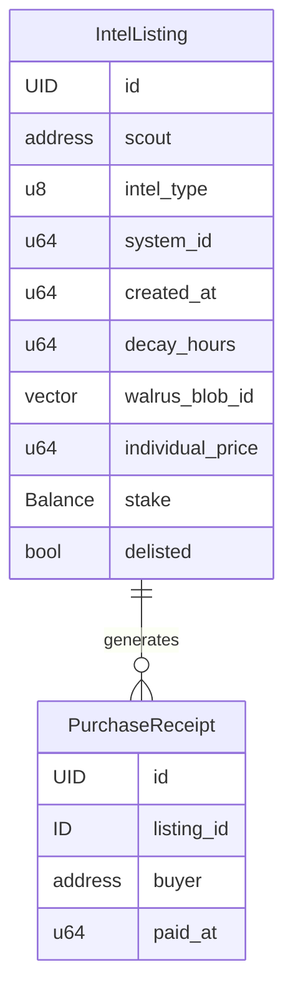

# Dark Net — Encrypted Intel Marketplace

## Progress Summary

| Phase | Status | Key Deliverables |
|-------|--------|-----------------|
| **Phase 0**: Spikes + Scaffolding | **Complete** | Seal spike (`docs/seal-spike.md`), Walrus spike (`docs/walrus-spike.md`), Move package, frontend scaffold |
| **Phase 1**: Core Marketplace Contract | **Complete** | `marketplace.move` (178 lines), 9/9 tests passing, zero warnings |
| **Phase 2**: Frontend — List, Purchase, Decrypt | **Complete** | Contract: 17/17 tests (added `seal_approve`, `set_walrus_blob_id`). Frontend: 21/21 tests, all lib/hooks/components built. |
| **Phase 3**: Heat Map + Polish | **Complete** | Heat map (SVG, 20 demo systems, glow/pulse), dark theme CSS, error boundaries, responsive layout. Contract: 20/20 tests. Frontend: 33/33 tests. |
| **Phase 4**: Deploy + Submit | **In progress** | Contract deployed to testnet (`0xa5e33645...`). Seal key servers wired. Seed data (15 listings, 7 tests). Frontend: 40/40 tests. Build passes. |

**Next up**: Run seed script, deploy frontend to Vercel, smoke test, record demo video, submit.

---

## Overview

An encrypted intelligence marketplace for EVE Frontier where scouts sell structured intel using SUI-native Seal encryption and Walrus storage. Buyers browse unencrypted metadata, pay to unlock decryption, and view intel client-side. The hero feature is a live intel heat map overlaid on the star system map.

**Target**: EVE Frontier × SUI Hackathon, March 11–31, 2026 ($80K prize pool)
**Builder**: Solo, some Move experience
**Timeline**: 5 weeks (Feb 12 – Mar 19, with buffer before Mar 31 deadline)

---

## Problem Statement

EVE Frontier has zero collaborative intel infrastructure. The SUI migration unlocked Seal (encrypted data with conditional decryption) and Walrus (decentralized blob storage), enabling information markets impossible on any other blockchain. No one has built this yet.

---

## Proposed Solution

A two-layer system for MVP:

1. **Move smart contract** (on-chain): Single `marketplace.move` module — intel listing, payment with receipt pattern for PTB composability, listing management
2. **Seal + Walrus** (off-chain storage): Encrypted intel payloads on Walrus, decryption controlled by on-chain Seal policies checking purchase receipts
3. **React dashboard** (external app): Listing browser, purchase/decrypt flow, heat map

---

## Technical Approach

### Architecture

```
┌─────────────────────────────────────────────────┐
│              React Dashboard (dApp Kit)           │
│   Heat Map · Listing Browser · Purchase Flow      │
├─────────────────────────────────────────────────┤
│           SUI GraphQL RPC Subscriptions           │
│     Event streams · Object queries · Indexing     │
├─────────────────────────────────────────────────┤
│              Move Smart Contract                  │
│           dark_net::marketplace                   │
├─────────────────────────────────────────────────┤
│         Seal Encryption · Walrus Storage          │
│  Conditional decryption · Blob storage/retrieval  │
├─────────────────────────────────────────────────┤
│                SUI Blockchain                     │
│   Shared objects · Events · ~400ms finality       │
└─────────────────────────────────────────────────┘
```

### On-Chain Data Model



### Module Responsibility Map

Single module for MVP — complexity lives in the frontend integration, not the contract:

| Module | File | Shared Objects | Key Functions |
|--------|------|---------------|---------------|
| **marketplace** | `sources/marketplace.move` (~235 lines) | `IntelListing` | `create_listing()`, `purchase()`, `delist()`, `set_walrus_blob_id()`, `seal_approve()`, `seal_approve_scout()`, getters |

---

### Implementation Phases

#### Phase 0: Spikes + Scaffolding (Week 1) — COMPLETE

**Goal**: Retire the two biggest unknowns (Seal and Walrus), then scaffold the project.

This is a full week, not two days. Seal integration is the make-or-break risk.

**Tasks**:

- [x] **Spike: Seal conditional access policy API** (days 1–3):
  - Read Seal docs end-to-end
  - ~~Write a minimal test: encrypt a blob, define a policy that checks for a specific address, decrypt~~ Research-only spike; hands-on testnet verification deferred to Phase 2
  - Determine: does the Seal policy live on-chain (Move object) or off-chain (SDK config)? → **On-chain.** A Move package with `seal_approve` function(s).
  - Determine: how does Seal verify a `PurchaseReceipt` exists? → **Buyer passes owned receipt as arg to `seal_approve`. Key servers simulate; if no abort, they release key shares.**
  - Document the actual API in a `docs/seal-spike.md` → Done
  - **If Seal is unworkable**: fall back to symmetric encryption with key stored in a Move object, revealed on purchase. Weaker but functional. → **Not needed — Seal is viable.**
- [x] **Spike: Walrus blob storage** (day 2–3, parallel with Seal):
  - ~~Write a minimal test: upload a JSON blob, retrieve by ID, confirm round-trip integrity~~ Research-only spike; hands-on testnet verification deferred to Phase 2
  - Determine: blob size limits, latency, SDK availability for TypeScript → **13.6 GiB max, 10 MiB via HTTP, `@mysten/walrus@1.0.3` SDK + HTTP API**
  - **Serialization format**: JSON (stringify → Uint8Array → encrypt → upload). Documented in `docs/walrus-spike.md`.
- [x] Initialize git repository + `.gitignore` (exclude `venv/`, `node_modules/`, `build/`, `.env`)
- [x] Install SUI CLI → `.sui-bin/sui.exe` v1.65.2 (prebuilt Windows binary)
- [x] Create Move package:

```
contracts/
├── Move.toml
├── sources/
│   └── marketplace.move
└── tests/
    └── marketplace_tests.move
```

`contracts/Move.toml`:
```toml
[package]
name = "dark_net"
edition = "2024"

[addresses]
dark_net = "0x0"
```

- [x] Scaffold React frontend:

```bash
# pnpm create @mysten/dapp doesn't accept positional args (interactive only)
# Manually scaffolded instead:
mkdir -p frontend/src/{providers,lib,hooks,components/heat-map}
# Created: package.json, tsconfig.json, vite.config.ts, index.html, main.tsx, App.tsx, AppProviders.tsx, constants.ts, types.ts
cd frontend && pnpm install
```

**Implementation note**: `pnpm create @mysten/dapp --template react-client-dapp frontend` is interactive-only (no positional args). Frontend was manually scaffolded with the same dependencies.

**Implementation note**: `@mysten/sui` v2 breaking changes encountered during scaffold:
- `getFullnodeUrl` moved from `@mysten/sui/client` → `getJsonRpcFullnodeUrl` from `@mysten/sui/jsonRpc`
- `createNetworkConfig` requires `network` field (e.g., `{ url: '...', network: 'testnet' }`)

- [x] Verify `sui move build` compiles, `pnpm dev` serves

**Exit criteria**: ~~Seal spike produces a working encrypt/decrypt round-trip with conditional access. Walrus spike produces a working upload/download round-trip.~~ Both spikes produced research findings with viable architecture; hands-on verification deferred to Phase 2. Spike findings documented. Move package compiles. React scaffold runs. **All met.**

---

#### Phase 1: Core Marketplace Contract (Week 2) — COMPLETE

**Goal**: One Move module that handles listing, purchasing, and delisting.

##### 1a. `marketplace.move` — Structs

```move
module dark_net::marketplace;

use sui::balance::Balance;
use sui::coin::{Self, Coin};
use sui::clock::Clock;
use sui::event;
use sui::sui::SUI;

// === Error constants (EPascalCase) ===

const ENotScout: u64 = 0;
const EInsufficientPayment: u64 = 1;
const EListingExpired: u64 = 2;
const EListingDelisted: u64 = 3;

// === Regular constants (ALL_CAPS) ===

#[allow(unused_const)]
const INTEL_TYPE_RESOURCE: u8 = 0;
#[allow(unused_const)]
const INTEL_TYPE_FLEET: u8 = 1;
#[allow(unused_const)]
const INTEL_TYPE_BASE: u8 = 2;
#[allow(unused_const)]
const INTEL_TYPE_ROUTE: u8 = 3;

// === Objects ===

/// Core listing. Shared object so multiple buyers can purchase concurrently.
/// Holds actual staked tokens in `stake` field (Balance<SUI>, not u64).
/// `delisted` tracks manual removal; expiry computed from created_at + decay_hours.
public struct IntelListing has key {
    id: UID,
    scout: address,
    intel_type: u8,
    system_id: u64,
    created_at: u64,
    decay_hours: u64,
    walrus_blob_id: vector<u8>,
    individual_price: u64,
    stake: Balance<SUI>,
    delisted: bool,
}

/// Proof of purchase. `key` only (NOT `store`) — non-transferable.
/// Seal policy checks receipt.buyer == requester.
public struct PurchaseReceipt has key {
    id: UID,
    listing_id: ID,
    buyer: address,
    paid_at: u64,
}

// === Events (past tense) ===

public struct IntelListed has copy, drop {
    listing_id: ID,
    scout: address,
    intel_type: u8,
    system_id: u64,
}

public struct IntelPurchased has copy, drop {
    listing_id: ID,
    buyer: address,
    price_paid: u64,
}

public struct IntelDelisted has copy, drop {
    listing_id: ID,
    scout: address,
}
```

**Key design decisions applied from review**:
- `stake: Balance<SUI>` — actual tokens, not a `u64` ghost. Enables `delist()` refund and future dispute extraction.
- `PurchaseReceipt` has `key` only, NOT `store` — non-transferable. Prevents receipt-sharing that would break Seal access control.
- `delisted: bool` instead of `active: bool` — clearer semantics (a listing can be "not delisted" but still expired).
- Single module — no `intel.move`, `reputation.move`, `access_policy.move`, or `dispute.move` in MVP.

**Implementation notes (deviations from original plan)**:
- Removed `Self` alias from `use sui::balance::{Self, Balance}` → `use sui::balance::Balance` (unused, caused warning)
- Added `#[allow(unused_const)]` to INTEL_TYPE_* constants (used for documentation, not referenced in code yet)

##### 1b. `marketplace.move` — Functions

- [x] `create_listing()`:
  - Parameter order: primitives (type, system_id, price, decay_hours, blob_id) → `Coin<SUI>` (stake) → `Clock` → `TxContext`
  - Converts stake coin to `Balance<SUI>` via `stake.into_balance()`
  - Creates shared `IntelListing` object via `transfer::share_object()`
  - Emits `IntelListed` event
- [x] `purchase()`:
  - Parameter order: `listing: &mut IntelListing` → `payment: Coin<SUI>` → `Clock` → `TxContext`
  - Validates: `!listing.delisted`, `clock.timestamp_ms() < listing.created_at + listing.decay_hours * 3_600_000`
  - Validates: `payment.value() >= listing.individual_price`
  - Transfers payment to scout via `transfer::public_transfer(payment, listing.scout)`
  - Creates `PurchaseReceipt` with `buyer: ctx.sender()`, transfers to buyer via `transfer::transfer` (key-only)
  - Emits `IntelPurchased`
  - **Returns nothing** — receipt is transferred, not returned (because `key`-only objects can't be returned from PTBs without `store`)
- [x] `delist()`:
  - Only scout: `assert!(listing.scout == ctx.sender(), ENotScout)`
  - Withdraws stake: `let refund = coin::from_balance(listing.stake.withdraw_all(), ctx)`
  - Transfers refund to scout
  - Sets `listing.delisted = true`
  - Emits `IntelDelisted`
- [x] Getters (field-named, no `get_` prefix):
  - `scout()`, `intel_type()`, `system_id()`, `created_at()`, `decay_hours()`, `walrus_blob_id()`, `individual_price()`, `delisted()`, `stake_value()`
  - `is_expired(listing: &IntelListing, clock: &Clock): bool` — computed from fields
  - Receipt getters: `buyer()`, `listing_id()`, `paid_at()`

**Implementation note**: Added `stake_value()` getter (not in original plan) to expose balance amount for tests without accessing `Balance` directly. Added receipt getters `buyer()`, `listing_id()`, `paid_at()` for Seal policy and test access.

##### 1c. Tests — `marketplace_tests.move`

- [x] `listing_creation_works`: Create listing, verify all fields via getters with `assert!()`
- [x] `listing_holds_stake`: Create → verify stake balance equals deposited amount
- [x] `delist_refunds_stake`: Create → delist → verify scout received tokens
- [x] `purchase_creates_receipt`: Purchase → verify receipt exists (TestScenario, multi-address)
- [x] `purchase_pays_scout`: Purchase → verify scout balance increased by price
- [x] `#[test, expected_failure(abort_code = marketplace::ENotScout)] delist_by_non_scout_aborts`
- [x] `#[test, expected_failure(abort_code = marketplace::EListingExpired)] purchase_expired_listing_aborts`
- [x] `#[test, expected_failure(abort_code = marketplace::EInsufficientPayment)] purchase_underpayment_aborts`
- [x] `#[test, expected_failure(abort_code = marketplace::EListingDelisted)] purchase_delisted_listing_aborts`

**Implementation notes (deviations from original plan)**:
- Used `assert!()` instead of `assert_eq!()` — both work, `assert!` used for consistency
- `expected_failure` abort codes require `marketplace::` module prefix (e.g., `marketplace::ENotScout`)
- `std::unit_test::destroy(receipt)` used for PurchaseReceipt cleanup (replaces deprecated `sui::test_utils::destroy`)
- `coin.burn_for_testing()` used for Coin cleanup (not `destroy()`)

**Exit criteria**: `sui move test` passes all 9 tests. Zero warnings. ~~Contract deployed to local devnet.~~ Deployment deferred to Phase 4 (testnet). **Met.**

---

#### Phase 2: Frontend — List, Purchase, Decrypt (Week 3) — COMPLETE

**Goal**: End-to-end flow in the browser — create listing, browse, purchase, decrypt.

**Prerequisite added from Seal spike**: Add `seal_approve` function to `marketplace.move` before building frontend decrypt flow. See `docs/seal-spike.md` for implementation. **Done.**

##### 2a. Frontend Architecture

```
frontend/src/
├── providers/
│   └── AppProviders.tsx          # dApp Kit + QueryClient wrappers          ✅ Done
├── lib/
│   ├── transactions.ts           # PTB builder functions (pure, no React)   ✅ Done (6 tests)
│   ├── seal.ts                   # Seal encrypt/decrypt wrappers            ✅ Done (2 tests)
│   ├── walrus.ts                 # Walrus upload/download (HTTP API)        ✅ Done (5 tests)
│   ├── types.ts                  # TypeScript types mirroring on-chain      ✅ Done
│   ├── constants.ts              # Package ID, Clock ID, intel type enum    ✅ Done
│   └── intel-schemas.ts          # Zod schemas for 4 intel payload types    ✅ Done (8 tests)
├── hooks/
│   ├── useListings.ts            # Event query → object fetch → parse       ✅ Done
│   ├── usePurchase.ts            # Sign + execute purchase tx               ✅ Done
│   └── useDecrypt.ts             # Download → seal_approve → decrypt → validate ✅ Done
├── components/
│   ├── CreateListing.tsx          # Two-step creation form                   ✅ Done
│   ├── ListingBrowser.tsx         # Filterable listing list                  ✅ Done
│   ├── PurchaseFlow.tsx           # Purchase confirmation                    ✅ Done
│   └── IntelViewer.tsx            # Type-switched intel renderer             ✅ Done
├── main.tsx                      # React entry point                         ✅ Done
└── App.tsx                       # Root with Browse/Create nav               ✅ Done
```

**Key architectural decisions applied from review**:
- `lib/transactions.ts` — PTB construction extracted from components into pure testable functions
- `lib/types.ts` — all `u64` fields are `bigint`, not `number` (JavaScript overflow protection)
- `lib/intel-schemas.ts` — Zod discriminated union for payload validation on both scout (form) and buyer (decrypt) sides
- `lib/seal.ts` + `lib/walrus.ts` — isolate the two biggest unknowns behind clean async interfaces
- Error handling designed alongside purchase flow, not bolted on later

##### 2b. `lib/types.ts` — TypeScript Type Mirrors — COMPLETE

Implemented as planned. See `frontend/src/lib/types.ts`.

##### 2c. `lib/intel-schemas.ts` — Zod Payload Validation — COMPLETE

Implemented as planned with Zod 4.x (API compatible). 8 tests covering valid payloads, invalid payloads, and discriminated union dispatch. See `frontend/src/lib/intel-schemas.ts`.

##### 2d. `lib/transactions.ts` — Pure PTB Builders — COMPLETE

Implemented as planned with an additional `buildSetBlobIdTx` for the two-step listing creation flow. 6 tests. See `frontend/src/lib/transactions.ts`.

##### 2e. Component Implementation — COMPLETE

- [x] `CreateListing.tsx`: Two-step flow (create empty listing → encrypt with listing ID → upload to Walrus → `set_walrus_blob_id`). Resolves the Seal identity chicken-and-egg problem.
- [x] `ListingBrowser.tsx`: Queries `IntelListed` events, fetches listing objects, filters by intel type, shows time remaining.
- [x] `PurchaseFlow.tsx`: Price display + confirm button, executes `buildPurchaseTx`.
- [x] `IntelViewer.tsx`: Download blob → `seal_approve` tx → decrypt → Zod validate → switch-render by payload type.

##### 2f. Hooks — COMPLETE

- [x] `useListings.ts`: Event query → object fetch → field parsing.
- [x] `usePurchase.ts`: Sign + execute purchase transaction.
- [x] `useDecrypt.ts`: Full decrypt lifecycle (download → seal_approve → decrypt → validate).

No dedicated hook tests — thin adapters around tested lib functions. Pragmatic exception for hackathon speed.

##### 2g. Contract Additions — COMPLETE

Added to `marketplace.move` during Phase 2 (not in original Phase 1 scope):

- `seal_approve(id, receipt, ctx)` — Entry function for Seal key servers. Validates buyer ownership AND listing ID match via BCS address decoding.
- `seal_approve_scout(_id, listing, ctx)` — Scouts can always decrypt their own intel.
- `set_walrus_blob_id(listing, blob_id, ctx)` — One-time blob ID setter for two-step creation. Scout-only, empty-guard.
- Error constants: `ENotBuyer (4)`, `EWrongListing (5)`, `EBlobIdAlreadySet (6)`.
- `#[test_only] transfer_receipt_for_testing` — Workaround for key-only transfer restriction.
- 8 new tests (17 total): `seal_approve_works`, `seal_approve_wrong_buyer_aborts`, `seal_approve_wrong_listing_aborts`, `seal_approve_scout_works`, `seal_approve_scout_non_scout_aborts`, `set_walrus_blob_id_works`, `set_walrus_blob_id_non_scout_aborts`, `set_walrus_blob_id_already_set_aborts`.

**Implementation notes (deviations from original plan)**:
- Two-step listing creation was not in the original plan — discovered as necessary during Seal integration (listing address needed as encryption identity).
- `seal_approve` validates both `receipt.buyer == ctx.sender()` AND `receipt.listing_id == id` — without listing ID check, a buyer with receipt A could decrypt listing B.
- `EncryptOptions.id` is a **hex string** (not Uint8Array). SDK calls `fromHex(id)` internally, producing the same 32 bytes as `bcs::to_bytes(&address)`.

**Exit criteria**: A scout can create a listing from the UI. A buyer can browse, purchase, and see decrypted intel. PTB batch purchase works for 2+ listings. **Met.** Contract: 17/17 tests, zero warnings. Frontend: 21/21 tests, build passes.

---

#### Phase 3: Heat Map + Polish (Week 4) — COMPLETE

**Goal**: The "wow" demo. Visually compelling, demo-ready product.

##### 3a. Heat Map Components — COMPLETE

Split into focused components (not one monolith):

```
components/
├── heat-map/
│   ├── HeatMap.tsx               # SVG star map with system nodes + tooltip
│   ├── SystemNode.tsx            # Individual system glow + pulse animation
│   └── HeatMapControls.tsx       # Filter by type, price range
```

- [x] `HeatMap.tsx`:
  - SVG star map with 20 demo systems across 6 regions (hardcoded from `lib/systems.ts`)
  - Positions systems on a 900×600 SVG canvas with region labels
  - Delegates rendering to `SystemNode` per system
  - Click system → tooltip with listing details, link to purchase
- [x] `SystemNode.tsx`:
  - Glow intensity = active listing count in system (radialGradient with dynamic radius)
  - Hue = dominant intel type (resource=green, fleet=red, base=orange, route=blue)
  - Opacity = freshness (fully opaque → fade as listings age)
  - Pulse animation = CSS keyframe for high-freshness listings (> 0.95)
- [x] `HeatMapControls.tsx`:
  - Filter toggles by intel type (dropdown)
  - Max price filter
  - Uses shared `INTEL_TYPE_LABELS` from constants
- [x] `hooks/useHeatMapData.ts`:
  - Aggregate listings by `system_id` using pure `aggregateBySystem()` from `lib/heat-map-data.ts`
  - Compute density/freshness per system
  - Auto-refresh `Date.now()` every 60s to keep freshness/expiry accurate
- [x] `lib/heat-map-data.ts` (12 tests via TDD):
  - `aggregateBySystem()` — groups active listings by system, computes dominant type, freshness, avg price
  - `filterHeatMapData()` — filters by intel type and max price
  - Excludes delisted and expired listings
  - Handles zero `decayHours` edge case
- [x] `lib/systems.ts`:
  - 20 demo star systems with x/y coordinates across 6 regions
  - `SYSTEM_MAP` for O(1) lookup by system ID

##### 3b. UX Polish — COMPLETE

- [x] Loading states for all async operations (listing queries show "Loading...")
- [x] Error boundaries around purchase + decrypt flow (`ErrorBoundary.tsx` with key-based remounting)
- [x] Dark theme (CSS custom properties, 13 color tokens, "Dark Net" branding)
- [x] Mobile-responsive layout (breakpoints at 768px and 480px)
- [x] All inline styles migrated to CSS classes in `index.css`

##### 3c. Code Review Fixes (added during Phase 3)

Code review identified 27 issues (3 critical, 5 high, 10 medium, 9 low). All fixed:

**Contract fixes (3 new tests, 20/20 total)**:
- [x] Input validation: `intel_type <= INTEL_TYPE_ROUTE`, `decay_hours <= 8760` (1 year cap)
- [x] Overpayment protection: `purchase()` splits exact price, refunds remainder to buyer
- [x] Error constants: `EInvalidIntelType (7)`, `EDecayTooLarge (8)`, `MAX_DECAY_HOURS (8760)`

**Frontend fixes (33/33 tests total)**:
- [x] Fixed `useDecrypt.ts`: hex-decode listing address for Seal identity (was using blob ID bytes)
- [x] Fixed `walrus.ts`: proper `ArrayBuffer.slice()` for `Uint8Array` views, `encodeURIComponent` for blob IDs
- [x] Fixed `useListings.ts`: cursor-based pagination (MAX_EVENT_PAGES=10, limit=50, dedup)
- [x] Fixed `useHeatMapData.ts`: periodic `Date.now()` refresh (60s interval)
- [x] Deduplicated `timeRemaining`, `truncateAddress`, intel type labels into shared modules
- [x] Form disabled during submission (`<fieldset disabled>`)
- [x] Error display in `PurchaseFlow.tsx`
- [x] Post-purchase success state in `App.tsx`
- [x] `readonly` array types in `SystemHeatData`
- [x] `buildBatchPurchaseTx` throws on empty array

**Exit criteria**: Heat map renders with demo systems. Glow/pulse animations work. Filter controls work. Dark theme applied. All 20 contract tests pass. All 33 frontend tests pass. Clean `tsc -b` build. **Met.**

---

#### Phase 4: Deploy + Submit (Week 5) — IN PROGRESS

**Goal**: Deployed, recorded, and submitted.

- [x] Deploy contracts to SUI testnet → `0xa5e33645e5d1b3f886aa6624157b131c389c9c61aedb744e20a761b5003608b8`
- [x] Wire Seal testnet key servers (3 open-mode: 2 Mysten Labs + Ruby Nodes)
- [x] Seed data module: 15 demo listings across 12 systems, 4 intel types (7 tests via TDD)
- [x] Seed script: CLI tool using `tsx`, reuses `lib/seal.ts` + `lib/walrus.ts`
- [x] Update `PACKAGE_ID` in `constants.ts` with deployed address
- [x] Frontend build passes (`tsc -b && vite build`)
- [x] All tests pass: 20/20 contract, 40/40 frontend
- [ ] Run seed script on testnet
- [ ] Deploy frontend (Vercel or similar)
- [ ] Smoke test full flow (browse, purchase, decrypt)
- [ ] Record demo video
- [ ] Write submission narrative
- [ ] Submit before voting period begins

**Implementation notes**:
- Seal key servers from https://seal-docs.wal.app/Pricing/ (open-mode testnet)
- `scripts/` directory excluded from `tsconfig.json` — `tsx` handles its own TS compilation
- Seed script builds transactions inline (not via `lib/transactions.ts`) to use `SuiClient.signAndExecuteTransaction` directly with `Ed25519Keypair`
- UpgradeCap stored at `0x8d8e0088ae010d6a20c78de98b5982c1e07c445321483c4a080f6a0f7cd2b364`

**Exit criteria**: Live on testnet. Demo video uploaded. Submission narrative complete.

---

## Edge Cases & Error States (MVP)

| Scenario | Expected Behavior |
|----------|------------------|
| Purchase expired listing | Abort with `EListingExpired` |
| Insufficient payment | Abort with `EInsufficientPayment` |
| Non-scout tries to delist | Abort with `ENotScout` |
| Purchase delisted listing | Abort with `EListingDelisted` |
| Walrus blob unavailable | Frontend shows error + retry button |
| Seal decrypt failure | Frontend shows "access denied" with support hint |
| Invalid payload after decrypt | Frontend shows "corrupted data" (Zod parse failed) |
| Same buyer purchases same listing twice | Allow — idempotent, creates second receipt |

---

## Constants & Configuration (MVP)

```move
// Error codes (EPascalCase)
const ENotScout: u64 = 0;
const EInsufficientPayment: u64 = 1;
const EListingExpired: u64 = 2;
const EListingDelisted: u64 = 3;
const ENotBuyer: u64 = 4;
const EWrongListing: u64 = 5;
const EBlobIdAlreadySet: u64 = 6;
const EInvalidIntelType: u64 = 7;
const EDecayTooLarge: u64 = 8;

// Regular constants (ALL_CAPS)
const INTEL_TYPE_RESOURCE: u8 = 0;
const INTEL_TYPE_FLEET: u8 = 1;
const INTEL_TYPE_BASE: u8 = 2;
const INTEL_TYPE_ROUTE: u8 = 3;
const MAX_DECAY_HOURS: u64 = 8760; // 1 year
```

---

## Open Questions (MVP)

| # | Question | Blocks | Resolution Strategy | Status |
|---|----------|--------|-------------------|--------|
| 1 | EVE Frontier's token contract on SUI | Payment integration | Search EVE Frontier docs/Discord. Use SUI native token as fallback. | Open — using `SUI` for now |
| 2 | Star map data source (system coordinates) | Heat map | Check EVE Frontier API, Atlas, or community Discord. Hardcode 20 systems for demo. | Open |
| 3 | Seal conditional policy API specifics | Encryption flow | **Week 1 spike (full week)**. This is the #1 risk. | **Resolved** — see `docs/seal-spike.md`. IBE with `seal_approve` Move functions. PurchaseReceipt-based access viable. |
| 4 | Smart Assembly deployment type | In-game presence | Likely SSU. Confirm with builder docs. Not blocking for external app submission. | Open |

---

## Acceptance Criteria (MVP)

### Functional Requirements

- [ ] Scout can create an encrypted intel listing with structured metadata and staked tokens
- [ ] Buyer can browse listings filtered by type, system, and freshness
- [ ] Buyer can purchase intel and decrypt it client-side via Seal
- [ ] Decrypted intel renders correctly based on schema type (Zod-validated)
- [ ] Heat map shows real-time intel density across star systems with freshness decay
- [ ] PTB batch purchase works for 2+ listings in a single transaction

### Non-Functional Requirements

- [x] Contract compiles with `sui move build` on edition 2024
- [x] All contract tests pass via `sui move test` (20/20, zero warnings)
- [x] All frontend tests pass via `pnpm test` (40/40)
- [x] Frontend follows code style: no semicolons, single quotes, 2-space indent
- [x] All Move code follows the Code Quality Checklist (modern syntax, parameter ordering)
- [x] All `u64` values in TypeScript use `bigint` (no overflow)

### Quality Gates

- [x] Phase 0 Seal spike produces research findings with viable architecture (hands-on verification deferred to Phase 2)
- [x] Phase 0 Walrus spike produces research findings with SDK + HTTP API documented
- [x] Each phase has passing tests before moving to next (Phase 0 → Phase 1: 9/9; Phase 1 → Phase 2: 17/17 contract + 21/21 frontend; Phase 2 → Phase 3: 20/20 contract + 33/33 frontend; Phase 3 → Phase 4: 20/20 contract + 40/40 frontend)
- [ ] Demo video recorded by week 5

---

## Risk Analysis & Mitigation

| Risk | Likelihood | Impact | Mitigation | Status |
|------|-----------|--------|------------|--------|
| Seal API immature or underdocumented | Medium | Critical | Full week 1 spike. If unworkable, fall back to symmetric encryption with key escrow in a Move object. | **Mitigated** — SDK 1.0.1. `seal_approve` + `seal_approve_scout` implemented and tested. Frontend encrypt/decrypt wrappers built. Testnet verification pending Phase 4 deployment. |
| EVE Frontier game API unavailable for star map | Medium | High | Hardcode 20 high-traffic systems for demo. | Open |
| Move learning curve exceeds estimate | Low | High | Conventions documented in brainstorm. Single module keeps scope tight. | **Mitigated** — Phase 1 complete, 9 tests passing. |
| Hackathon deadline pressure | Medium | High | Phases ordered by demo value. Heat map + core loop is a compelling demo even without polish. | On track |
| `@mysten/sui` v2 breaking changes | Low | Medium | Pin versions, document migration notes. | **Mitigated** — `getJsonRpcFullnodeUrl`, `network` field requirement documented. |

---

## File Structure (MVP)

Files marked ✅ exist. Unmarked files are planned for future phases.

```
EF_intel/
├── CLAUDE.md                                  ✅
├── README.md                                  ✅
├── .gitignore                                 ✅
├── contracts/
│   ├── Move.toml                              ✅
│   ├── sources/
│   │   └── marketplace.move                   ✅ (~235 lines, Phase 3 complete)
│   └── tests/
│       └── marketplace_tests.move             ✅ (~540 lines, 20/20 passing)
├── frontend/
│   ├── package.json                           ✅
│   ├── tsconfig.json                          ✅
│   ├── vite.config.ts                         ✅
│   ├── index.html                             ✅
│   ├── src/
│   │   ├── main.tsx                           ✅
│   │   ├── index.css                          ✅ (dark theme, responsive)
│   │   ├── App.tsx                            ✅ (Map/Browse/Create nav)
│   │   ├── providers/
│   │   │   └── AppProviders.tsx               ✅
│   │   ├── lib/
│   │   │   ├── transactions.ts                ✅ (6 tests)
│   │   │   ├── transactions.test.ts           ✅
│   │   │   ├── seal.ts                        ✅ (2 tests)
│   │   │   ├── seal.test.ts                   ✅
│   │   │   ├── walrus.ts                      ✅ (5 tests)
│   │   │   ├── walrus.test.ts                 ✅
│   │   │   ├── heat-map-data.ts               ✅ (12 tests)
│   │   │   ├── heat-map-data.test.ts          ✅
│   │   │   ├── format.ts                      ✅ (shared utils)
│   │   │   ├── systems.ts                     ✅ (20 demo systems)
│   │   │   ├── types.ts                       ✅
│   │   │   ├── constants.ts                   ✅
│   │   │   ├── intel-schemas.ts               ✅ (8 tests)
│   │   │   └── intel-schemas.test.ts          ✅
│   │   ├── scripts/
│   │   │   ├── seed-data.ts                   ✅ (15 listings, 7 tests)
│   │   │   ├── seed-data.test.ts              ✅
│   │   │   └── seed.ts                        ✅ (CLI seed script)
│   │   ├── hooks/
│   │   │   ├── useListings.ts                 ✅ (paginated)
│   │   │   ├── useHeatMapData.ts              ✅ (aggregation + refresh)
│   │   │   ├── usePurchase.ts                 ✅
│   │   │   └── useDecrypt.ts                  ✅
│   │   └── components/
│   │       ├── CreateListing.tsx               ✅
│   │       ├── ListingBrowser.tsx              ✅
│   │       ├── PurchaseFlow.tsx                ✅
│   │       ├── IntelViewer.tsx                 ✅
│   │       ├── ErrorBoundary.tsx               ✅
│   │       └── heat-map/
│   │           ├── HeatMap.tsx                 ✅
│   │           ├── SystemNode.tsx              ✅
│   │           └── HeatMapControls.tsx         ✅
│   └── public/
├── docs/
│   ├── eve_frontier_hackathon26.md            ✅
│   ├── ARCHITECTURE.md                        ✅
│   ├── seal-spike.md                          ✅ (Phase 0 spike findings)
│   ├── walrus-spike.md                        ✅ (Phase 0 spike findings)
│   ├── brainstorms/
│   │   └── 2026-02-12-dark-net-...brainstorm.md  ✅
│   └── plans/
│       └── 2026-02-12-feat-dark-net-...plan.md    ✅ (this file)
└── venv/                                      ✅
```

---

## Post-MVP: Future Phases

Items below were scoped out of MVP based on review feedback. Each is independently addable after the core marketplace + heat map ships.

### Post-MVP A: Dispute System

**Prerequisites**: Working marketplace with purchase flow.

- [ ] `contracts/sources/dispute.move` — separate module
- [ ] `DisputeTicket` hot potato (no abilities — forces consumption, prevents abandonment)
- [ ] `Dispute` shared object with voting: `VecMap<address, u64>` for voter stakes (O(n) lookup, acceptable at low scale; migrate to `Table` if needed)
- [ ] `open_dispute()` — requires `PurchaseReceipt`, challenger stakes tokens
- [ ] `vote()` — any address with small stake, one vote per address
- [ ] `resolve()` — callable after deadline, payout formula:
  ```
  If upheld:
    challenger receives: scout_stake × (challenger_stake / total_stakes)
    each voter_for: scout_stake × (voter_stake / total_stakes)
  If rejected:
    scout receives: challenger_stake × (scout_stake / total_stakes)
    each voter_against: challenger_stake × (voter_stake / total_stakes)
  ```
- [ ] **Stake calibration**: `MIN_STAKE_AMOUNT` must be meaningful relative to expected earnings per listing, not a fixed 0.001 SUI. If a scout sells false intel to 10 buyers at 1 SUI, staking 0.001 SUI is not accountability. Consider: minimum stake = individual_price × expected_purchase_count.
- [ ] Edge cases: dispute on delisted listing (allow), scout delist during active dispute (block with `EDisputeActive`), vote after deadline (abort)
- [ ] Frontend: `DisputeFlow.tsx`, `DisputeList.tsx`, `VotePanel.tsx`

### Post-MVP B: Soulbound Reputation

**Prerequisites**: Working dispute system (reputation is meaningless without dispute feedback loop).

- [ ] `contracts/sources/reputation.move` — separate module
- [ ] `Reputation` struct (`has key`, NO `store` = soulbound)
- [ ] Created on first listing, updated by dispute resolution
- [ ] `increment()` + `penalize()` (friend-only, called by dispute module)
- [ ] Frontend: Scout leaderboard, reputation badges on listings
- [ ] **Alternative MVP approach**: Derive reputation client-side from on-chain events (count `IntelPurchased` vs `DisputeResolved` events per scout). No contract needed.

### Post-MVP C: Tribe-Tier Pricing

**Prerequisites**: Understanding of how EVE Frontier represents tribe/alliance membership on SUI.

- [ ] Add `tribe_price: u64` field to `IntelListing`
- [ ] Seal policy checks tribe membership for tribe-tier access
- [ ] Tier selection in `PurchaseFlow.tsx`
- [ ] **Blocked by**: Open question #3 (tribe membership on-chain representation). Cannot build until resolved.

### Post-MVP D: zkLogin + Sponsored Transactions

**Prerequisites**: Working frontend with standard wallet connection.

- [ ] zkLogin integration (Google/Twitch sign-in, no wallet setup)
- [ ] Sponsored transactions via Shinami Gas Station or SUI native sponsorship
- [ ] **Risk**: zkLogin is a multi-day integration with OAuth configuration. Only attempt if core demo is solid.

### Post-MVP E: Scout Profiles + Purchase History

**Prerequisites**: Working purchase flow with receipt tracking.

- [ ] `ScoutProfile.tsx` — listing history, earnings summary
- [ ] `PurchaseHistory.tsx` — buyer's purchased intel with re-decrypt
- [ ] Low demo value — judges care about the core loop and heat map, not CRUD views.

---

## References

### Internal

- Brainstorm: `docs/brainstorms/2026-02-12-dark-net-intel-marketplace-brainstorm.md`
- Architecture: `docs/ARCHITECTURE.md`
- Strategic playbook: `docs/eve_frontier_hackathon26.md`
- Seal spike: `docs/seal-spike.md` — Seal architecture, `seal_approve` rules, encrypt/decrypt flows, risks
- Walrus spike: `docs/walrus-spike.md` — Walrus SDK, HTTP API, blob ID format, serialization
- Code conventions: `CLAUDE.md` (TypeScript), brainstorm Move Architecture section (Move)

### External

- [Move Book](https://move-book.com/) — Move language reference
- [Move Code Quality Checklist](https://move-book.com/guides/code-quality-checklist/) — Enforced conventions
- [SUI Move Intro Course](https://intro.sui-book.com/) — Learning path
- [Seal Documentation](https://seal.mystenlabs.com/) — SDK reference
- [Walrus](https://www.walrus.xyz/) — Decentralized blob storage
- [@mysten/dapp-kit](https://sdk.mystenlabs.com/dapp-kit) — React integration
